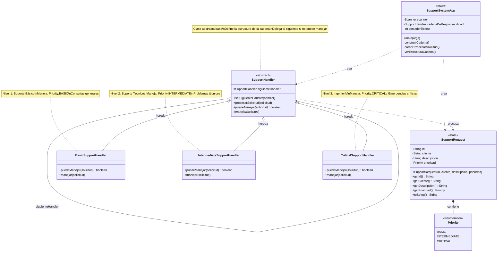

# 🔗 SISTEMA DE SOPORTE MULTINIVEL - CHAIN OF RESPONSIBILITY

**Patrón de Diseño: Chain of Responsibility**

**Estudiante:** Javier Rodríguez
**Código:** 20231020172  
**Universidad:** Universidad Distrital Francisco José de Caldas  
**Materia:** Ingeniería de Software

---

## 📋 Descripción del Proyecto

Sistema de soporte técnico que implementa el patrón **Chain of Responsibility** para gestionar solicitudes de clientes con diferentes niveles de prioridad. El sistema permite procesar tickets de soporte de manera desacoplada, donde cada nivel de soporte decide si puede manejar la solicitud o delegarla al siguiente nivel en la cadena.

## 🎯 Objetivos

- ✅ Implementar correctamente el patrón Chain of Responsibility
- ✅ Desacoplar el emisor de solicitudes de los receptores
- ✅ Permitir escalabilidad mediante la adición de nuevos niveles sin modificar código existente
- ✅ Crear una aplicación interactiva para demostrar el funcionamiento del patrón

## 🏗️ Diagrama UML - Patrón Chain of Responsibility



## 📁 Estructura del Proyecto

```
src/
├── models/
│   └── SupportRequest.java         # Solicitud de soporte con prioridad
│
├── handlers/
│   ├── SupportHandler.java         # Handler abstracto (clase base)
│   ├── BasicSupportHandler.java    # Nivel 1: Soporte básico
│   ├── IntermediateSupportHandler.java  # Nivel 2: Soporte técnico
│   └── CriticalSupportHandler.java # Nivel 3: Ingeniería
│
└── main/
    └── SupportSystemApp.java        # Aplicación principal interactiva
```

## 🚀 Compilación y Ejecución

### Compilar

```bash
cd src
javac models/*.java handlers/*.java main/*.java
```

### Ejecutar

```bash
java main.SupportSystemApp
```

### Limpiar

```bash
rm models/*.class handlers/*.class main/*.class
```

## 🔗 Patrón Chain of Responsibility

### Concepto

El patrón **Chain of Responsibility** permite que una solicitud pase a través de una cadena de objetos receptores hasta que uno de ellos la maneje. Cada objeto en la cadena tiene la opción de:

1. **Procesar la solicitud** si puede manejarla
2. **Delegarla** al siguiente objeto en la cadena
3. **Terminar** la cadena si no hay más handlers

### Ventajas del Patrón

✅ **Desacoplamiento**: El cliente no sabe qué handler procesará la solicitud  
✅ **Flexibilidad**: Fácil agregar o reorganizar handlers en la cadena  
✅ **Responsabilidad Única**: Cada handler tiene una responsabilidad específica  
✅ **Open/Closed Principle**: Abierto para extensión, cerrado para modificación  

### Estructura de la Cadena

```
Cliente envía solicitud
        ↓
┌─────────────────────┐
│  BasicSupportHandler │  ← ¿Prioridad BASIC?
└──────────┬──────────┘
           │ NO → Delega
           ↓
┌─────────────────────┐
│ IntermediateSupportHandler │ ← ¿Prioridad INTERMEDIATE?
└──────────┬──────────┘
           │ NO → Delega
           ↓
┌─────────────────────┐
│ CriticalSupportHandler │ ← ¿Prioridad CRITICAL?
└─────────────────────┘
```

## 🎮 Funcionalidades del Sistema

### 1. Crear Solicitud de Soporte

Permite crear tickets con:
- **Nombre del cliente**
- **Descripción del problema**
- **Nivel de prioridad**:
  - `BASIC` - Consultas generales, preguntas simples
  - `INTERMEDIATE` - Problemas técnicos, configuraciones
  - `CRITICAL` - Sistemas caídos, emergencias

### 2. Procesar en Cadena

La solicitud se procesa automáticamente a través de la cadena:
- Si el nivel puede manejarla → La procesa
- Si no puede → La escala al siguiente nivel
- Si ningún nivel puede → Muestra error

### 3. Ver Estructura

Muestra el flujo visual de la cadena de responsabilidad y características del patrón.

## 🎯 Cumplimiento de Requisitos

| Requisito | Estado | Implementación |
|-----------|--------|----------------|
| Separar responsabilidades | ✅ | Cada handler en clase separada |
| Permitir escalabilidad | ✅ | Fácil agregar nuevos niveles |
| Reducir acoplamiento | ✅ | Cliente no conoce implementación |
| Sin centralización | ✅ | No hay clase central con if/else |
| Clase base abstracta | ✅ | `SupportHandler` abstracta |
| Composición para encadenar | ✅ | `siguienteHandler` |
| Cliente sin conocimiento | ✅ | Solo llama a `procesarSolicitud()` |

## 🔧 Restricciones Cumplidas

✅ **No centralización**: La lógica está distribuida en cada handler  
✅ **Sin condicionales externos**: El cliente no decide qué handler usar  
✅ **Composición**: Handlers se relacionan mediante `siguienteHandler`  
✅ **Desacoplamiento**: Cliente solo conoce la interfaz abstracta  
✅ **Clase base abstracta**: `SupportHandler` define el contrato  

## 🎓 Conceptos Clave

### Handler (Manejador)
Objeto que puede procesar una solicitud o delegarla al siguiente en la cadena.

### Cadena de Responsabilidad
Secuencia de handlers conectados donde cada uno tiene la oportunidad de procesar la solicitud.

### Delegación
Acción de pasar la solicitud al siguiente handler cuando el actual no puede procesarla.

### Desacoplamiento
El cliente no necesita saber qué handler procesará su solicitud ni cómo está estructurada la cadena.

## 📖 Referencias

- **Design Patterns: Elements of Reusable Object-Oriented Software** - Gang of Four
- **Head First Design Patterns** - Freeman & Freeman
- **Effective Java (3rd Edition)** - Joshua Bloch

## 👨‍💻 Autor

**Javier Rodríguez Rincón**  
Código: 20231020172  
Universidad Distrital Francisco José de Caldas  
Ingeniería de Sistemas

---